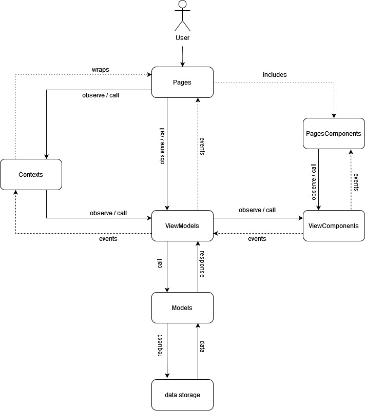

# About this app
It's a simple story dice (icons) roller.
Features:
- tell a story (roll icons)
- change lang (English or Polish)
- change theme (dark and light)

# Run locally
## Requirements
- Node.js (>= 16) is installed
- yarn or npm is installed

## How to run?
1. Download repo.
2. Go to the main folder.
3. Run `yarn install`.
4. Run `yarn start` to run app in the dev mode.
5. App is available under `localhost:3000`.

# How to deploy?
0. Change version in the `package.json`.
1. Merge all changes to the master.
2. Refresh master locally. \
`git pull origin main`
3. Create git tag. \
`git tag -a vX.X.X -m "What was done"` \
`git push --tags`
4. Run `yarn deploy`.
5. Wait... wait...
6. Go to the `https://ndv66.github.io/character-maker/`
7. See your changes :)

# Architecture
## Overview

## Folders
*Warning!* Everything important parts should be always exported by a module`index.ts`.
- `/doc` \
    Documentation, version features etc.
- `/public` \
    All public data, for example: favicon.
- `/src`\
    Source code folder.
    - `modelBuilder.ts`
    - `appEnvs.ts`
    - `App.tsx`
    - `/data` \
        All **const** data for the app (translations, icon names, errors, color themes etc.).
    - `/models` \
        Models with logic for this app.
    - `/pages` \
        Visual part of this app.
        - `/<name>Component` \
        A dedicated areas of a page(s).
    - `/tests` \
        Test for the app.
        - `/models` \
            Tests for models.
    - `/tools` \
        All tools and small helpers.
    - `/types` \
        All important types and all enums.

## Naming conventions
- use camelCase
- "real" const should have THIS_NAME
- follow DRY!
- less code in more files is better than more code in less files :)
### Models
- should be named as `<Name>Model`
- file name should be the same as the model name
- should export it's interface, named as `I<Name>`
- model class should implement its interface
- use as vanilla TS as possible
### ViewModels
- should be named as `<ViewName>ViewModel`
- file name should be the same as the viewModel name
- should export it's interface, named as `I<ViewName>ViewModel`
- viewModel class should implement its interface
- can use RxJS (if needed)
- can combine its own logic with dedicated view components, but not with other view models
### ViewComponents
- "small" view model
- should be named as `<ViewName>ViewComponent`
- file name should be the same as the viewComponent name
- should export it's interface, named as `I<ViewName>ViewComponent`
- viewComponent class should implement its interface
- can use RxJS (if needed)
### Contexts & ContextWrappers
- React Context
- should be named as `<Name>Context`
- should have its `<Name>ContextWrapper` as a separate file
- file name should be the same as the context name
- should export it's interface, named as `I<Name>Context`
- context should use its interface
- can use RxJS (if needed)
### Pages
- should be named as `<Name>Page`
- file name should be the same as the page name
- can use RxJS (if needed)
- all logic should be placed inside its own hook (often in the same file)
### PageComponents
- should be named as `<Name>PageComponent`
- file name should be the same as the pageComponent name
- can use RxJS (if needed)
- all logic should be placed inside its own hook (often in the same file)

# User Stories (short)
## Overview
1. As an user I want to have dice available (with default amount and category) just after page is loaded. *DONE*
2. As an user I want to change app lang and keep it after reload page. *DONE*
3. As an user I want to change app theme and keep it after reload page. *DONE*
4. As an user I want to have information about author. *DONE*
5. As an user I want to have link to the author's Github. *DONE*
5. As an user I want to have link to this repo. *DONE*
## Dice amount
1. As an user I want to have new icons just after I changed dice amount with no additional steps. *DONE*
## Categories
1. As an user I want to have new icons just after I changed dice categories with no additional steps. *DONE*
2. As an user I want to have option to select more than 1 category and never less than 1. *DONE*
# Reroll
1. As an user I want like to have an option to reroll all dice. *DONE*

# Developer Stories (short)
## Documentation
1. As a developer, I want to have documentation. *DONE*
2. As a developer, I want to have architecture description. *DONE*
## Deploy
1. As a developer, I want to have deploy description. *DONE*
2. As a developer, I want to have tag creating description. *DONE*
## Development
1. As a developer, I want to have instruction how to run locally. *DONE*
## Tests
1. As a developer I want to have tests for Models. *DONE*
2. As a developer I want to have tests for ViewModels. *DONE*
3. As a developer I want to have tests for ViewComponents. *DONE*
4. As a developer I want to have tests for Pages. *DONE*
5. As a developer I want to have tests for PagesComponents. *DONE*
5. As a developer I want to have e2e tests. *TODO v2*

# Thanks!
https://nagoshiashumari.github.io/Rpg-Awesome/
